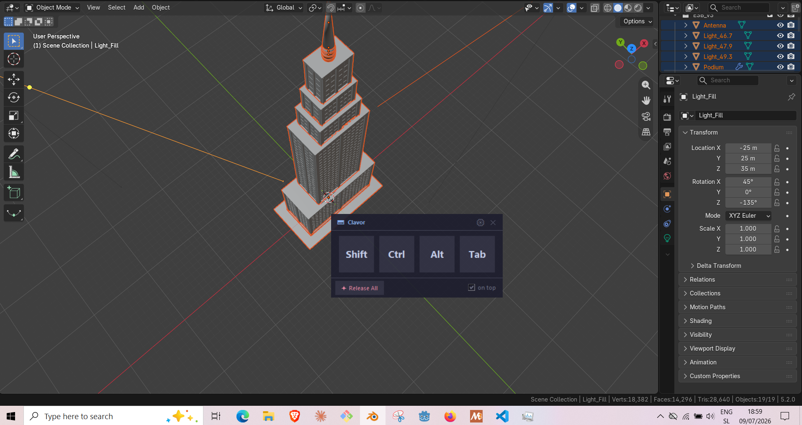
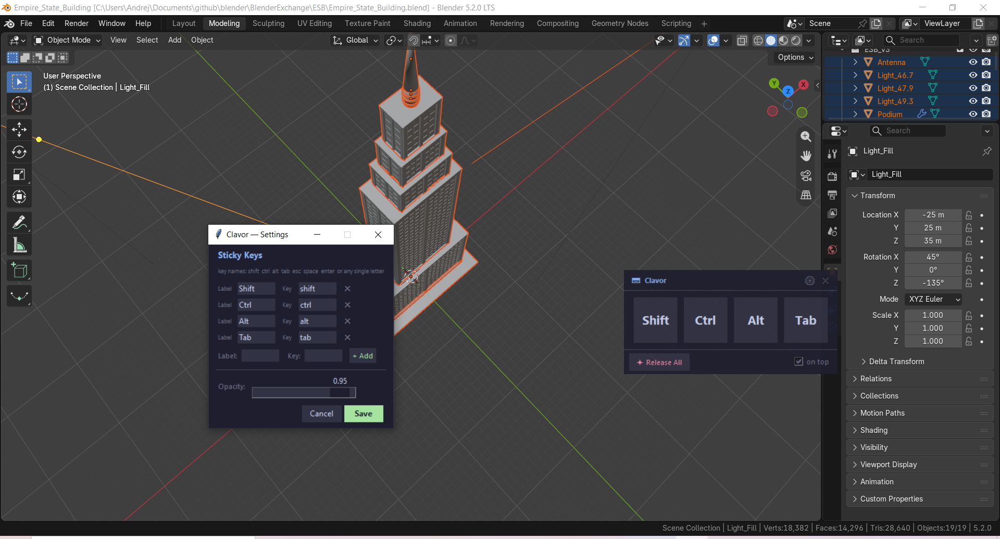

# ⌨ Clavor

**A tiny floating sticky-key widget for one-handed Blender workflows.**

Clavor lets you hold modifier keys (Shift, Ctrl, Alt, Tab, or any key you configure) system-wide with a single click — so you can do mouse operations in Blender without needing to hold a key down physically. Click the button to latch a key; click again or press **Release All** to let it go.

Designed for accessibility. Built for Blender. Works with any app.

---

## Screenshots





---

## Features

- 🔒 **Sticky keys** — click to hold, click again to release
- 🪟 **Non-stealing focus** — the widget never steals focus from Blender (WS_EX_NOACTIVATE on Windows)
- 🎛 **Configurable** — add, remove, or relabel keys via the settings panel
- 🌙 **Catppuccin Mocha** theme — easy on the eyes in a dark studio setup
- 📌 **Always-on-top** option — toggle from the footer
- 🔲 **Draggable** — position remembered between sessions
- 🔆 **Adjustable opacity**
- ⚡ **Lightweight** — pure Python, no background services

---

## Download

**[⬇ Download Clavor.exe](https://gumroad.com/l/clavor)** ← pre-built for Windows

No install needed. Drop the `.exe` anywhere and run it.  
Settings are saved as `clavor.json` next to the executable.

---

## Usage

1. Run `Clavor.exe`
2. Click a key button to hold it
3. Do your mouse operation in Blender (or any app)
4. Click the button again — or press **✦ Release All** — to release

### Settings (⚙ gear icon)

- Add or remove buttons with custom labels and key names
- Adjust opacity
- Supported key names: `shift` `ctrl` `alt` `tab` `esc` `space` `enter` `backspace` `delete` `caps` `f1`–`f12`, or any single letter

---

## Platform

**Windows only** — the no-focus-steal trick (`WS_EX_NOACTIVATE`) is a Windows-specific feature. Running on Linux/macOS will work but the widget will steal focus when clicked.

---

## Build from source

Requires Python 3.10+ and pip.

```bat
git clone https://github.com/YOUR_USERNAME/clavor
cd clavor
build.bat
```

The executable appears in `dist\Clavor.exe`.

Or manually:

```bat
pip install pynput pyinstaller
pyinstaller Clavor.spec --noconfirm
```

### Dependencies

| Package | Purpose |
|---------|---------|
| [pynput](https://pypi.org/project/pynput/) | System-wide key press/release |
| [tkinter](https://docs.python.org/3/library/tkinter.html) | UI (bundled with Python) |
| [PyInstaller](https://pyinstaller.org/) | Build tool only, not in the exe |

---

## Configuration file

`clavor.json` is created next to the exe on first save. You can edit it by hand:

```json
{
  "keys": [
    { "label": "Shift", "key": "shift" },
    { "label": "Ctrl",  "key": "ctrl"  },
    { "label": "Alt",   "key": "alt"   },
    { "label": "Tab",   "key": "tab"   }
  ],
  "always_on_top": true,
  "opacity": 0.93,
  "pos_x": null,
  "pos_y": null
}
```

---

## License

MIT — free to use, modify, and redistribute.  
Made by [Alienish Games](https://github.com/YOUR_USERNAME).

---

## Why?

I had a stroke. Using Blender one-handed means you can't hold Shift while orbiting, or Ctrl while snapping. Clavor solves that with a floating widget that does the holding for you.
